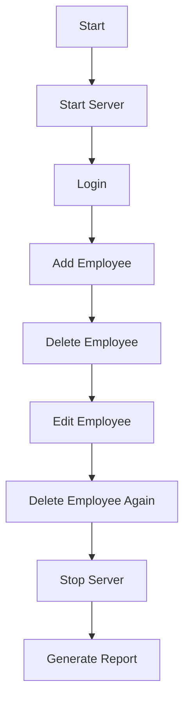
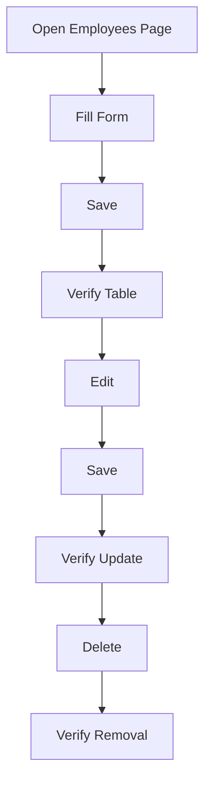

# Playwright Test Documentation

Author: Neha Jadav  
Version: 1.1.0  
Support: neha.jadav@gmail.com

## Overview
This document explains all Playwright tests, how they are organized, and how to run them individually or as a group. It also provides execution flowcharts, estimated durations, and snapshots guidance.

## Test Structure
- `tests/auth.spec.js` ? login positive/negative cases
- `tests/employees.spec.js` ? CRUD and list/table behavior
- `tests/login.spec.js` ? minimal login check
- `tests/qa-suite.spec.js` ? 6 core QA checks with reporting
- `tests/helpers.js` ? shared login helper

## How Tests Are Organized
- All tests live under `tests/`
- Shared helpers in `tests/helpers.js`
- QA bundle uses `scripts/run-qa-suite.js`
- Reports generated by `scripts/generate-test-report.py`

## Running Tests
Run all tests:
```
npm test
```

Run QA suite (headless):
```
npm run test:qa:headless
```

Run QA suite (headful):
```
npm run test:qa:headful
```

Run single test file:
```
npx playwright test tests/qa-suite.spec.js
```

Run single test by title (Chromium):
```
npx playwright test tests/qa-suite.spec.js -g "Edit user works" --project=chromium
```

List all tests:
```
npx playwright test --list
```

## Test Cases (QA Suite)
1. Start and stop the application and verify
2. Login successfully with admin/admin123
3. Add testing user after verifying it doesn't exist
4. Delete employee works (remove testing user)
5. Edit user works (add, edit, save, verify)
6. Delete employee works again (cleanup another user)

## Estimated Runtime
- Chromium: ~10?20 seconds
- Firefox: ~12?25 seconds
- Full QA suite (both): ~30?60 seconds

## Snapshots
Screenshots are saved under:
`test-results/screenshots/<run-id>/`

Report includes annotated screenshots with test name + browser.

## Flowcharts (Mermaid)

### QA Suite Execution


### CRUD Flow


## Code Examples (with comments)

### Login Helper
```js
// Shared login helper
const { expect } = require("@playwright/test");

async function login(page, { username, password }) {
  // Open login page
  await page.goto("/");
  // Fill credentials
  await page.fill("#username", username);
  await page.fill("#password", password);
  // Submit
  await page.click("#loginBtn");
  // Verify redirect
  await expect(page).toHaveURL(/\/employees/);
}

module.exports = { login };
```

### QA Suite Runner
```js
// Run chromium + firefox sequentially and generate report
const headful = process.env.HEADFUL === "1";
// ... spawn playwright for each project
```

## Reporting
Reports are generated into:
`docs/test-reports/TestReport-<timestamp>.docx`

Includes:
- Per-browser status
- Failure reasons
- Annotated screenshots
- Summary table

## Pre-Reqs
- Node.js 18+
- npm
- Playwright browsers installed
  - `npx playwright install`

## Troubleshooting
- If login tests fail, confirm selectors match UI
- If app restarts on add/delete, use `npm start` or ignore data file changes
- If port 3000 is in use, stop the process or reuse existing server
